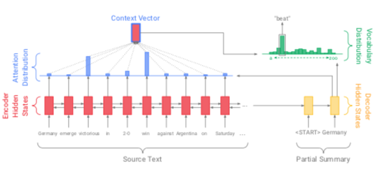
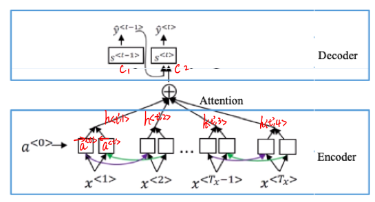
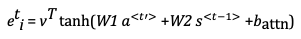
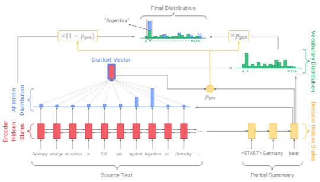
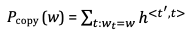
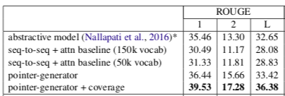

Table of Contents
=================

  \* [Table of Contents](#table-of-contents)

  \* [Data Preparation](#data-preparation)

  \* [Seq2Seq with Attention](#seq2seq-with-attention)

   \* [Introduction](#introduction)

   \* [Network architecture](#network-architecture)

  \* [Pointer-generator](#pointer-generator)

   \* [Introduction](#introduction-1)

   \* [Network architecture](#network-architecture-1)

​     \* [Copy distribution](#copy-distribution)

​     \* [Coverage mechanism](#coverage-mechanism)

   \* [Implementation](#implementation)

   \* [Model Evaluation](#model-evaluation)

   \* [Result for financial dataset](#result-for-financial-dataset)

  \* [BERT](#bert)

  \* [Sentiment Analysis](#sentiment-analysis)

  

# Data Preparation

* **Datasets**: 
  * Non-financial
    * [CNN and Daily Mail](https://github.com/vcccaat/cnn-dailymail)
    * Yelp Review Dataset
  * Financial
    * [Reuters dataset (100k news) ](https://github.com/duynht/financial-news-dataset)
* **Packages used**:
  * nltk 
  * keras
  * pandas
  * sklearn
  * numpy
  * corenlp-stanford
* **Data Preprocessing Pipeline for Reuters Dataset**:
  * tokenize 
  * remove stop words
  * ... 

  

# Seq2Seq with Attention

## Introduction 

Encoder contains the input words that want to be transformed (translate, generate summary), and each word is a vector that go through forward and backward activation with bi-directional RNN. Then calculate the attention value for each words in encoder reflects its importance in a sentence. Decoder generates the output word one at a time, by taking dot product of the feature vector and their corresponding attention for each timestamp. 

 

  

## Network architecture

 

* **Encoder**: Bi-directional RNN, feature vector `a` at timestamp `t` is the concatenation of forward RNN and backward RNN 

    

    

* **Attention**: : the amount of attention  should pay to 

  * Done by a neural network takes previous word  in the decoder and  in the encoder generate  go through softmax to generate 

  

  ​             

  * additive attention for neural network: 

      

  * simplier ways can choose dot-product attention:

      

      

* **Decoder**: RNN of dot product between attention and activation

    

    

# Pointer-generator 

## Introduction

Abstrative text summarization requires sequence-to-sequence models, these models have two shortcomings: they are liable to reproduce factual details inaccurately, and they tend to repeat themselves. The state-of-the-art pointer-generator model came up by Google Brain at 2017 solves these problems. In addition to attention model, it add two features: first, it **copys** words from the source text via *pointing* which aids accurate repro- duction of information. Second, it uses **coverage** to keep track of what has been summarized, which discourages repetition. 

 

  

## Network architecture

In addition to attention, we add two things:

### Copy distribution

* **Copy** frequent words occur in the text by adding distribution of the same word

   

   

     

* **Combine** copy distribution `Pcopy`with general attention vocabulary distribution `Pvocab`(computed in attention earlier: ) with certain weight `Pgen`:  *p*gen ∈ [0, 1] for timestep *t* is calculated from the context vector `a`∗, the decoder state `s`and the decoder input `c` :

    

   

    

* **Training**: use `Pfinal` to compute sigmoid probability  

  

### Coverage mechanism 

record certain sentences that have appear in decoder many times

* **Sum the attention** over all previous decoder timesteps, `c`  represents the degree of coverage that those words have received from the attention mechanism so far.

      

* **additive attention** of previous seq2seq attention model has changed to:

    

* **add one more term for loss**

​    **loss = softmax loss +**   

  

## Implementation

 [**GitHub Code Here**](https://github.com/vcccaat/pointer-generator)

  

## Model Evaluation

 

**Example from [Paper:](https://arxiv.org/abs/1704.04368)**

 

  

## Result for financial dataset

Incoming.. 

    

# BERT

Incoming...

    

# Sentiment Analysis

**VADER**

focused on social media and short texts unlike Financial News, used available package in nltk, easy to use.

  

**CNN**

on yelp dataset

  

**LSTM** with transformer

on yelp dataset

  

**DPCNN**

on yelp dataset

  

**Deep and Wide Learning (Google)**

on yelp dataset