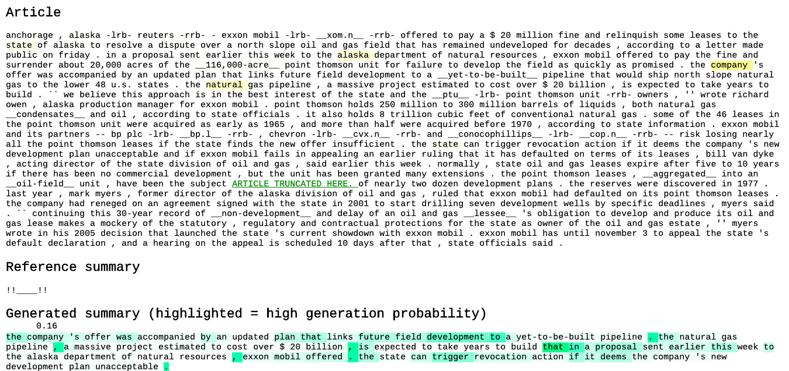
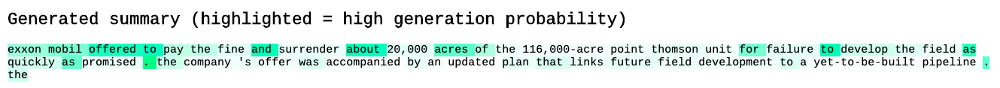
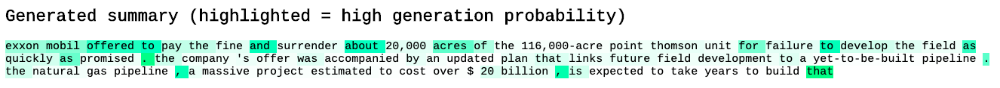
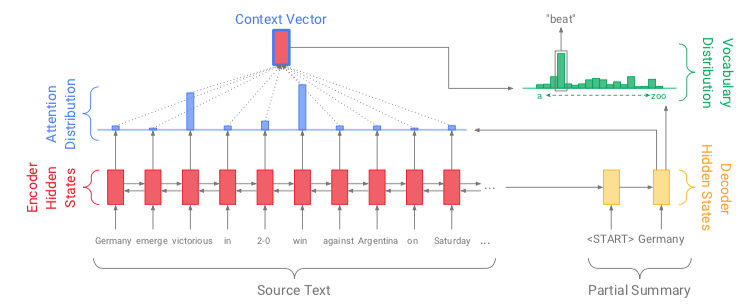
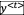
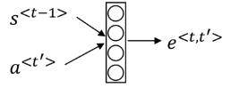
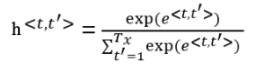
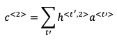
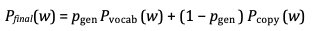
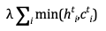

Models are credited to [Xin Pan Peter Liu](https://github.com/tensorflow/models/tree/master/research/textsum) and [Google Brain](https://github.com/vcccaat/pointer-generator)


Table of Contents
=================

   * [Table of Contents](#table-of-contents)
   * [Data Preparation](#data-preparation)
   * [Pipeline for Financial Dataset](#pipeline-for-financial-dataset)
      * [Result for financial news](#result-for-financial-news)
   * [Seq2Seq with Attention](#seq2seq-with-attention)
      * [Introduction](#introduction)
      * [Network architecture](#network-architecture)
   * [Pointer-generator](#pointer-generator)
      * [Introduction](#introduction-1)
      * [Network architecture](#network-architecture-1)
         * [Copy distribution](#copy-distribution)
         * [Coverage mechanism](#coverage-mechanism)
      * [Implementation](#implementation)
      * [Model Evaluation](#model-evaluation)
   * [BERT](#bert)
   * [Sentiment Analysis](#sentiment-analysis)

<br><br>

# Data Preparation

* **Datasets**: 

  * Non-financial
    * [CNN and Daily Mail](https://github.com/vcccaat/cnn-dailymail)
    * Yelp Review Dataset
  * Financial
    * [Reuters dataset (100k news) ](https://github.com/duynht/financial-news-dataset)

* **Environment**

  * Python=3.6
  * tensorflow=1.2.1
  * numpy=1.16

  * nltk 

  * pandas

  * sklearn

  * corenlp-stanford

  * pyrouge  

* **Pretrain-model** 

  * [Version for Tensorflow 1.2.1](https://drive.google.com/file/d/0B7pQmm-OfDv7ZUhHZm9ZWEZidDg/view?usp=sharing)

<br><br>

# Pipeline for Financial Dataset

* tokenize text using corenlp-stanford `python test_summary.py`

* stored in test.bin

* use pre-train model to decode 

  ```
  python run_summarization.py --mode=eval --data_path=/path/to/data/test.bin --vocab_path=/path/to/data/vocab --log_root=/path/to/directory/containing/pretrained_model --exp_name=pretrained_model --max_enc_steps=400 --max_dec_steps=100 --coverage=1
  ```

  you can adjust number of encode (input passage length) and decode step (ouput summary length)

<br>

* **Sample abstractive summary for CNN news:** [Here](https://github.com/vcccaat/nlp/tree/master/text-summarization/sample_summary)

  <br>

## Result for financial news

* Visualize the attention network with [this](https://github.com/abisee/attn_vis)

  For Python3 run: `python -m http.server`

  * result with coverage and output 100 words:

   

  * result with coverage and output 50 words:

    machine copy the whole sentence in the paragraph...

  

  * result without coverage and output 100 words:

    machine copy the whole sentence in the paragraph...

  * 


<br><br>

# Seq2Seq with Attention

## Introduction 

Encoder contains the input words that want to be transformed (translate, generate summary), and each word is a vector that go through forward and backward activation with bi-directional RNN. Then calculate the attention value for each words in encoder reflects its importance in a sentence. Decoder generates the output word one at a time, by taking dot product of the feature vector and their corresponding attention for each timestamp. 

  

<br>

## Network architecture

  

* **Encoder**: Bi-directional RNN, feature vector `a` at timestamp `t` is the concatenation of forward RNN and backward RNN 

    

  <br>

* **Attention**: : the amount of attention  should pay to 

  * Done by a neural network takes previous word  in the decoder and  in the encoder generate  go through softmax to generate 

      

  * additive attention for neural network: 

      

  * simplier ways can choose dot-product attention:

      

    <br>

* **Decoder**: RNN of dot product between attention and activation

    
  
  **Beam search** is used in decoder to  keep up to *k* most likely words choice, where *k* is a user-specified parameter (beam width).

<br><br>

# Pointer-generator 

## Introduction

Abstrative text summarization requires sequence-to-sequence models, these models have two shortcomings: they are liable to reproduce factual details inaccurately, and they tend to repeat themselves. The state-of-the-art pointer-generator model came up by Google Brain at 2017 solves these problems. In addition to attention model, it add two features: first, it **copys** words from the source text via *pointing* which aids accurate repro- duction of information. Second, it uses **coverage** to keep track of what has been summarized, which discourages repetition. 

 

<br>

## Network architecture

In addition to attention, we add two things:

<br>

<br>

### Copy distribution

* **Copy** frequent words occur in the text by adding distribution of the same word

   

   

   <br>

* **Combine** copy distribution `Pcopy`with general attention vocabulary distribution `Pvocab`(computed in attention earlier: ) with certain weight `Pgen`:  *p*gen ∈ [0, 1] for timestep *t* is calculated from the context vector `a`∗, the decoder state `s`and the decoder input `c` :

    

   

  <br>

* **Training**: use `Pfinal` to compute sigmoid probability  

<br><br>

### Coverage mechanism 

record certain sentences that have appear in decoder many times

* **Sum the attention** over all previous decoder timesteps, `c`  represents the degree of coverage that those words have received from the attention mechanism so far.

   

* **additive attention** of previous seq2seq attention model has changed to:

    

* **add one more term for loss**

  **loss = softmax loss +**   

<br><br>

## Implementation

* **Training  from scratch:** [**GitHub Code Here**](https://github.com/vcccaat/pointer-generator)

* **Transfer learning**

  Use a  pre-trained model ([Version for Tensorflow 1.2.1](https://drive.google.com/file/d/0B7pQmm-OfDv7ZUhHZm9ZWEZidDg/view?usp=sharing)) which is a saved network that was previously trained  by others on a large dataset. Then I don't need to re-train the model with number of hours starting from scratch (for this model it takes around 7 days to train the data), and the pre-trained model built from the massive dataset could already effectively served as a generic model of the visual world.

  <br><br>

## Model Evaluation

**Model Performance**

 

 

 

**Metrics used:**

**ROUGE-1**：overlap of **unigrams** between the system generated summary and reference summary / number of 1-gram in reference summary

**ROUGE-2**： overlap of **bigrams** between the system generated summary and reference summaries / number of 2-gram in reference summary

**ROUGE-L**： overlap of **LCS** (Longest Common Subsequence) between system generated summary and reference summaries / number of 1-gram in reference summary

 


**Example from [Paper:](https://arxiv.org/abs/1704.04368)**

 

<br><br>


# BERT

Incoming...

<br><br><br><br>

# Sentiment Analysis

**VADER**

focused on social media and short texts unlike Financial News, used available package in nltk, easy to use.

<br>

**CNN**

on yelp dataset

<br>

**LSTM** with transformer

on yelp dataset

<br>

**DPCNN**

on yelp dataset

<br>

**Deep and Wide Learning (Google)**

on yelp dataset